<br/>

CheckChaek(이하 쳌책)을 지난 1년동안 꽤나 열심히 썼습니다<br/>
<a href="./checkChaek.md">처음 만들었을 때도</a>, 지금도 매우 단순한 기능을 갖고 있지만 나름대로 천천히 그리고 꾸준히 발전해 왔습니다
<br/><br/>

## 주요 고도화 기능
- 완독 도서를 대상으로 평점 기능 추가
- 도서 관심 기능 및 관심 목록 페이지 추가
- 도서 검색 시 결과 목록에서 도서의 서재 내 존재 여부, 관심 여부 표시(사용자 기준)
- 관리자 페이지 보안 강화

# CheckChaek 📚
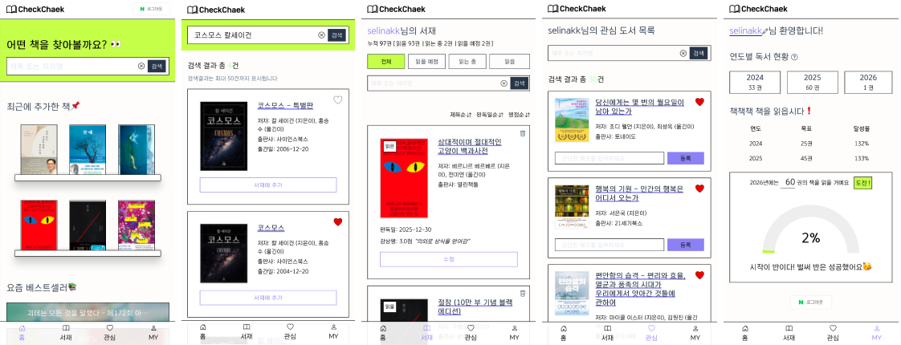

<br/>

## 주요 변화
### 홈
여러 사용자의 서재 정보를 랜덤으로 보여주는 '쳌책 사용자들의 서재를 둘러봐요'를 없애고 '요즘 베스트셀러'를 만들었습니다<br/>
1위부터 10위까지 순서대로 나열합니다

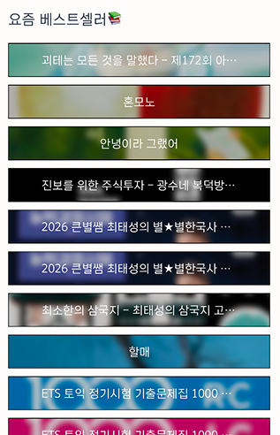

알라딘 API 감사합니다🙏

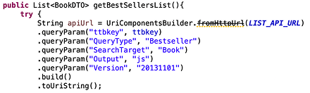

### DBMS
DBMS를 MySQL에서 PostgreSQL로 변경했습니다<br/>
배경은 이렇습니다<br/>
AWS에서 돌리던 쳌책 서버를 과금 이슈때문에 친구들에게 양해를 구하고 종료했습니다<br/>
인스턴스를 정지했는데도 희한하게 몇달동안 소액 결제가 계속 되어 계정까지 삭제해 버렸습니다<br/>
친구들 데이터를 백업해두었으나 다시 서버를 운영할 엄두가 안 나서 한동안 로컬에서 개인용으로 사용했습니다<br/>
그러다 접근성의 한계를 느껴 Oracle Cloud에서 재배포를 시도하게 됐습니다<br/>
무료 티어에서 웹+MySQL DB를 동시에 돌리기는 어려워 DB를 분리하기로 했습니다<br/>
무료 DB 서비스를 찾아보니 MySQL 환경은 없다시피 하고 PostgreSQL은 제법 존재했습니다<br/>
그중 <a href="https://supabase.com">Supabase</a>에서 무료 PostgreSQL 환경을 구축하고 애플리케이션과의 연결을 성공했습니다<br/>

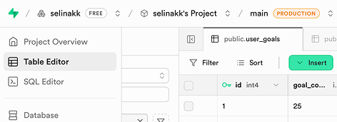

<br/>

DB 마이그레이션 과정에서 JPA(Hibernate)가 아주 유용했습니다!

```js
spring.jpa.hibernate.ddl-auto=update
```

위 옵션은 보통 **validate**로 설정하죠 validate는 Entity 클래스와 스키마의 일치 여부를 검증만 합니다<br/>
**update**는 Entity 정의를 기반으로 스키마를 수정합니다<br/>
제 PostgreSQL 스키마는 비어있었기에 update 옵션을 통해 테이블이 자동 생성되었습니다<br/>
이후 기존 DB와 똑같이 동작하도록 일부 컬럼 타입이나 제약조건을 약간 수정 후 기존 데이터를 csv 포맷으로 import 했습니다<br/><br/>

## 추가된 기능
### 사용자
사용자가 연도별로 읽은 책 목록을 추가했습니다<br/>
쳌책을 실사용하다 보니 지난 연도에 몇 권을 읽었는지 확인이 어려워서 추가한 부분입니다

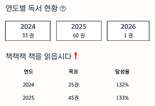

마이페이지에서 연도별 완독 목록으로 이동할 수 있습니다<br/>
지금은 2024,2025,2026 세 개만 있어 3열로 나열을 했지만 내년부터는 다른 UI로 접근을 해야할 것 같아요<br/>
목표 달성 또한 지난 연도는 확인이 어려워 표 형식으로 지난 목표와 달성율을 보여주고 있습니다<br/>

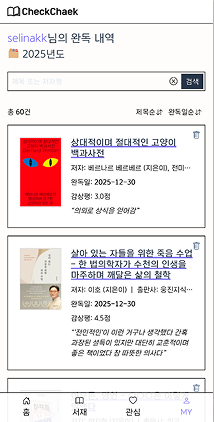

목록 페이지입니다 서재와 거의 비슷한 포맷이에요<br/><br/>

### 평점
최초 개발 시에는 서재 테이블에 감상평 값이 있어 평점이 불필요하다고 생각했어요<br/>
그런데 제가 평가한 도서들을 객관적으로 정렬할 수 없으니 좀 답답했어요<br/>
서재에 도서를 추가할 때 상태가 read이면 완독일, 감상평 그리고 평점을 입력할 수 있어요<br/>

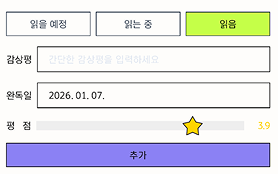

range 타입 인풋을 사용했고 0.1점 단위로 값 설정이 가능합니다<br/>


부수적으로 서재에 평점순 정렬을 추가했습니다<br/>

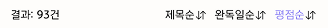

이 기능이 독서 취향이나 생각을 정리하는 데에 도움이 되는 것을 느꼈습니다<br/><br/>

### 관심 도서
서재에 ‘읽을 예정’으로 도서를 추가하는 방식으로 일종의 관심 역할을 수행해 왔습니다<br/>
하지만 관심이 있어 저장해 두고 싶은 것과 정말로 ‘읽을‘ 것에는 차이가 있었습니다 찜과 장바구니가 별개이듯 말이죠<br/>
서재가 수십 권의 관심 책들로 점령되는 일을 방지하고자, 메모장의 관심 책 목록을 쳌책으로 옮기고자 관심 기능을 추가했습니다<br/>
도서 항목마다 하트 버튼을 달아 관심 추가/삭제 토글이 되게 했습니다<br/>

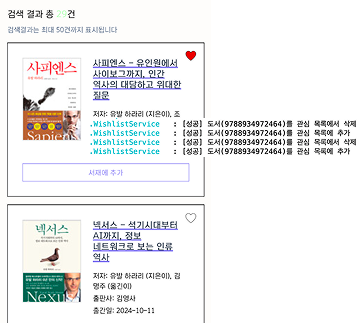

버튼을 눌렀을 때 해당 도서가 관심 목록 DB에 있는지 확인해서 없으면 추가하고, 있으면 삭제하는 방식입니다<br/>
이 부분은 비동기 방식으로 구현하였습니다<br/>

관심 도서 목록 페이지를 메인 탭 메뉴에 넣었습니다<br/>
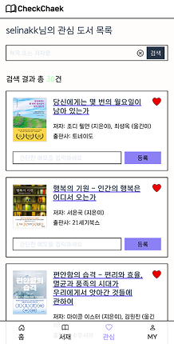

서재와 마찬가지로 비로그인 상태로 이 페이지를 요청하면 네이버 로그인으로, 로그인이 되어있으면 해당 사용자의 목록으로 리다이렉트 됩니다


또한, 사용자가 다른 사용자의 서재 또는 관심 목록을 볼 수 있지만 id가 일치하지 않는 경우 수정/삭제 UI가 미노출되며 서버로 요청을 하더라도 걸러줍니다<br/><br/>


### 검색 목록에서 데이터 체크
원래는 검색 결과 목록에서 ‘서재에 추가 버튼‘을 누르거나 도서 링크를 클릭해 상세 페이지로 들어가야 서재 존재 여부를 확인할 수 있었습니다<br/>
지금보니 초기 UX가 은근히 불편했네요<br/>
검색 목록에서부터 관심 또는 서재 데이터베이스에 해당 도서가 존재하는지 확인이 가능하게 로직을 추가했습니다

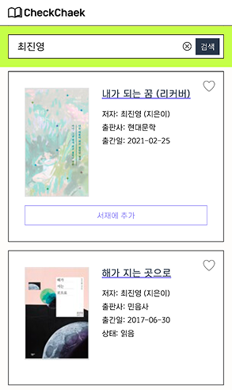

서재에 존재한다면 서재에 추가하는 인풋을 아예 감추고 상태 값을 보여주게 했습니다<br/><br/>

### 관리자 페이지 보안 강화
기존 관리자 페이지는 컨트롤러에 하드코딩해둔 아이디, 비번을 입력 폼으로 전송해서 로그인하는 방식이었습니다<br/>
임시로 해놓은건데 생각보다 관리자 페이지 들어갈 일이 별로 없어서 그 상태로 시간이 흘렀죠<br/>
그러다 고도화로 인해 관리자 페이지 구조를 손볼 일이 있어서 내친김에 로그인 방식도 개선했습니다<br/>
관리자 페이지에 접속하려면 제 계정으로 네이버 로그인이 되어있어야 합니다<br/>
아이디가 null이거나 저와 일치하지 않는 경우는 관리자 페이지의 어떤 경로로 들어가든 interceptor를 통해 사용자 홈으로 튕겨냅니다<br/>
관리자 인터셉터는 원래 적용되어 있었는데 네이버 로그인으로 검증을 하기에 보안이 +1 강화되었습니다

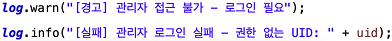
<br/>

---

## 소감
쳌책을 애용하는 개발자로서 개선점을 찾으면 메모해 뒀다가 발전시키곤 했습니다<br/>
첫 개인 프로젝트를 꾸준히 품고 있는 것에 자부심도 느낍니다<br/>
현시점에서 혼자 사용하는 쳌책을 위해 자정 넘어서까지 코딩을 하곤 했어요<br/>
독서와 개발을 융합한 멋진 취미가 되었습니다<br/>
저는 언젠가 IT 업계를 떠나더라도 취미로 개발을 할 것 같아요<br/>
DIY라고 할까요 내 필요에 의해 내가 만들어 가는 웹이 참 재밌거든요<br/>
이제 다시 사용자(친구)들을 초대하려 합니다!<br/>

