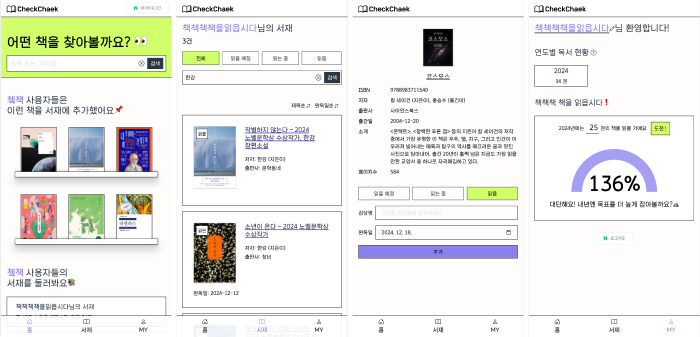
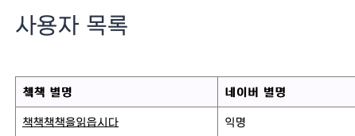
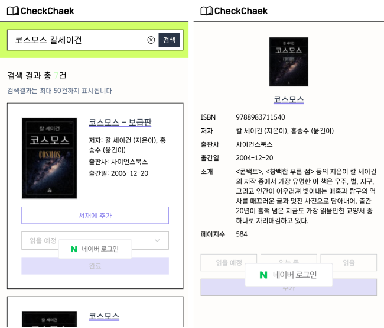
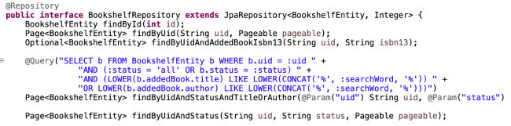
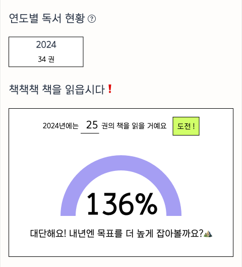

 

CheckChaek(쳌책)이라는 이름의 서재 서비스를 개발 했습니다 
**독서 목표를 설정하고 독서 활동을 기록**하는 간단한 서비스입니다
  

## 개발 동기
서재 서비스는 부트캠프 팀 프로젝트에서 제가 제안했던 주제입니다 
저의 의견과 다른 팀원의 의견을 합쳐 실제 프로젝트는 웹툰, 웹소설, 도서 리뷰 및 추천 플랫폼으로 개발되었습니다 
백엔드 과정을 수료 후 개인 프로젝트를 진행하고자 했고, 저에게 필요한 기능만 담은 가벼운 서비스로 개발하게 되었습니다  

# CheckChaek 📚

## 주요 기능

### 사용자
로그인은 네이버를 통해서만 가능하게 했습니다 
웹사이트 자체 회원가입은 과감히 가입을 생략했고 카카오 vs 네이버 고민하다가 네이버로 결정했습니다 

_한국소비자연맹에 따르면 소셜 로그인 시 주로 사용하는 소셜미디어 1순위가 네이버(51.2%), 2순위가 카카오(39.8%)라고 합니다_

 
회원 정보가 딱히 필요하지 않은 서비스라서 별명만 수집하고 있습니다 
네이버로 쳌책 서비스에 로그인하면 네이버 별명이 서비스 내의 닉네임으로 기본 설정되며 변경 가능합니다

 
사용자가 탈퇴하면 사용자, 사용자 목표, 서재 테이블에서 해당 유저 데이터가 삭제됩니다 
다만 네이버 아이디 로그인 특성상 재가입에 제약이 없습니다 데이터만 리셋될 뿐  

### 홈
홈에서는 최근에 추가된 도서를 6권 진열하고 있습니다 
참고로 저는 최대한 서버 용량 부담을 줄이기 위해 도서 검색과 조회는 알라딘 API를 이용하고, 서재에 추가된 도서에 한해 서버에 저장하고 있습니다 
이 추가된 도서 데이터들을 홈에서 노출하는 것입니다 

또한 서재 데이터가 있는 랜덤 사용자(최대 4인)의 서재 정보를 노출합니다 
다른 사용자들이 어떤 책을 읽고 있는지 둘러볼 수 있습니다 
당연히 타인의 서재 데이터 수정/삭제는 불가하며 감상평은 해당 서재의 주인에게만 보입니다

### 서재
앞서 말했듯이 서재에 추가하기 위한 도서 검색 및 상세 정보 조회는 알라딘 API를 이용하고 있습니다 
도서를 서재에 추가하면 해당 도서의 기본 정보가 서버에 함께 저장됩니다 
데이터 관련 요청은 로그인 상태를 요구하므로 UI에서부터 세션의 uid 값을 기준으로 명확하게 로그인 여부를 구분합니다 
대부분의 서재 CUD 요청은 ajax 비동기 처리했습니다 
서재의 도서 상태는 "읽을 예정", "읽는 중", "읽음" 세 가지로 구분되며, 도서의 상태가 "읽음"일 때에만 완독일과 감상평을 입력할 수 있게 UI를 설계했습니다 

 
팀 프로젝트 때는 MyBatis를 썼는데 paging이랑 sorting에서 시간을 많이 소모했습니다 게다가 페이징 방법을 찾아도 JPA를 이용하는 방법이 대부분이었어요 그래서 개인 프로젝트는 JPA Data pagination을 적용했습니다 
확실히 쿼리문 작성에 소요되는 시간이 대폭 줄었고 백엔드 코딩이 조금 더 수월했습니다 
다만 UI에서 sorting을 추가한 페이징을 넣는 건 MyBatis와 별 차이 없이 복잡했습니다 
이건 저의 JPA 숙련도의 문제일 수도 있겠다만 일단 이번 첫 시도는 그랬습니다 
 

 

### 마이페이지
서재나 마이페이지에 접근하면 Interceptor가 로그인 여부를 확인하고 false일 때 네이버 로그인으로 리다이렉트 합니다 
연간 목표를 설정하면 달성도 게이지를 보여줍니다 
서재의 완독일 연도 기준으로 연도별 독서량 집계합니다

 

---

## Room for improvement
첫 개인 풀스택 프로젝트이다 보니 간단한 웹 서비스로 개발했다 
개발을 하며 '이게 되네' 순간들도 있었고, '왜 안되지?' 순간들도 있었다 후자가 더 많았던 점이 아쉽다 
3주 동안 꾸준히 조금씩 완성시켜 결실을 본 점은 뿌듯하다 
주변인들부터 시작해서 서비스를 확장시킬 계획이다 
다만 주변에 독서가가 별로 없어 아직 실사용자가 없다 
확실히 나는 잘 사용하고 있다 😂 
기량을 발전시켜 개인화된 도서 추천 기능을 제공하는 추천 탭을 추가하고 싶다 