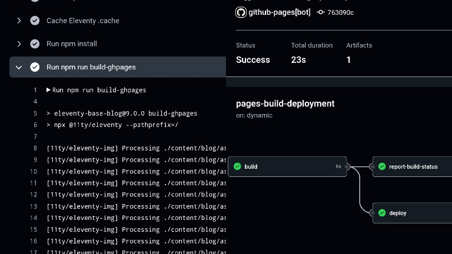

 

최근 정적인 웹 배포를 통해 접한 개념 **CI**와 **CD**
  

## CI (Continuous Integration, 지속적인 통합)
- 목적: 개발자가 작성한 코드를 자주 병합하고 자동으로 테스트하여 코드 품질을 유지하는 것 
- 과정: 코드를 자주 병합하고, 병합할 때마다 자동으로 테스트와 빌드가 실행됩니다. 이 과정에서 코드의 버그나 문제가 발생하지 않는지 확인하여 코드 품질을 높이는 것이 목표 
- 예: 코드가 Git에 푸시될 때, 자동으로 빌드와 테스트가 실행되는 과정

## CD (Continuous Deployment/Delivery, 지속적인 배포/전달)
- 목적: CI 과정을 통해 테스트와 빌드를 통과한 코드를 자동으로 배포하여 사용자가 바로 사용할 수 있도록 만드는 것 
- 과정: CI가 끝난 후 빌드가 통과되면 자동으로 배포 프로세스가 시작되어, 변경사항이 실시간으로 서버에 반영 

## Continuous Deployment vs Delivery 차이점

- **Continuous Delivery**: 배포 준비가 완료된 상태로 자동화되지만, 실제 배포는 수동으로 실행할 수도 있음(배포 타이밍을 원하는대로) 즉, 수동 승인 단계가 있는 배포 
- **Continuous Deployment**: 모든 배포 과정이 완전히 자동화되어 코드 변경 후 바로 배포까지 이어짐 

  
Github Pages는 CI/CD의 좋은 예시입니다 
코드를 푸시하면 자동으로 배포까지 이어지기 때문입니다 
11ty로 만든 이 Github Pages 블로그를 예로 들어볼게요  

먼저 CI 과정 

코드 작성 → 코드 푸시 → Github Actions가 11ty 빌드 실행 → **빌드 결과물(HTML, CSS, JS 등) 생성** 
 
이 과정에서 빌드 성공/실패 여부 확인

그 다음 CD 과정 
CI에서 생성괸 빌드 결과물을 **Github Pages에 자동 배포**

 

좌측은 CI의 빌드 과정, 우측은 CI/CD 파이프라인
 

## Github Pages의 CD(지속적 배포) 특징
- HTML, CSS, JavaScript 같은 정적 파일만 호스팅 가능
- 데이터베이스나 서버 사이드 코드는 실행할 수 없음
- 블로그, 포트폴리오, 문서 사이트에 최적화
- 특정 브랜치(main 또는 gh-pages)에 코드를 올리면 자동으로 배포
- 자동화된 빌드 프로세스
