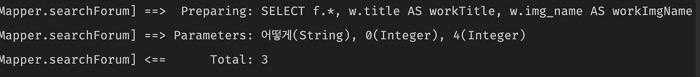
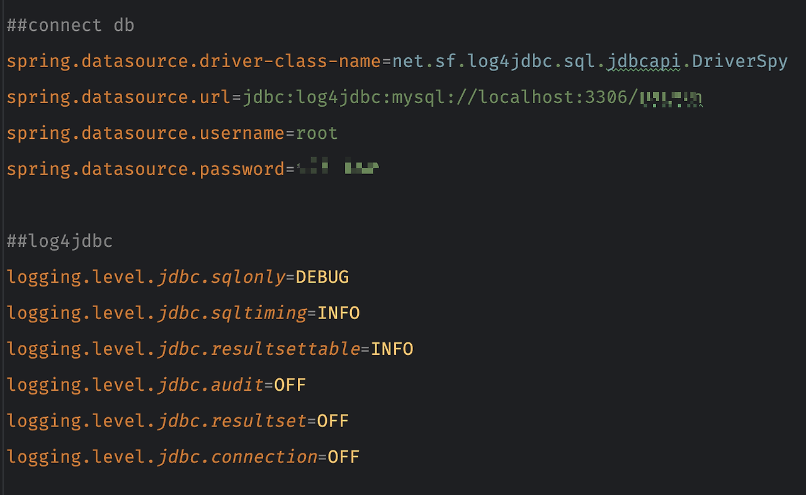
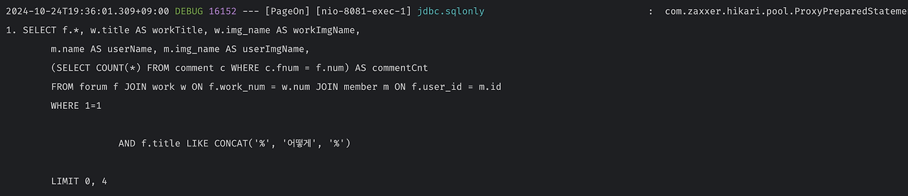
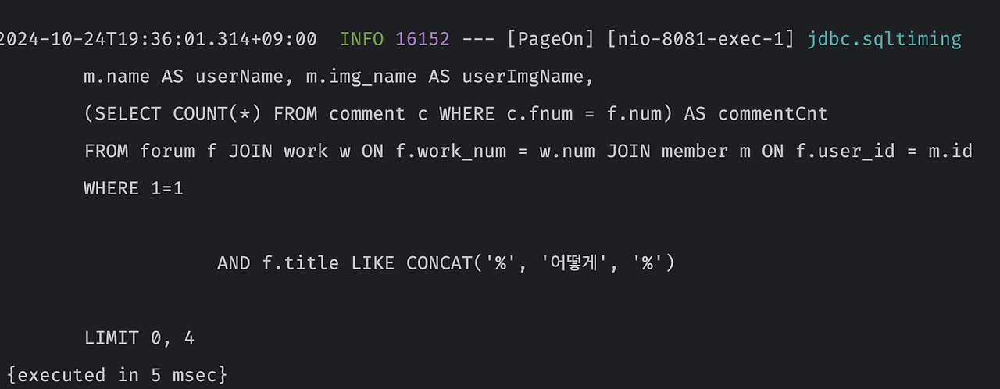
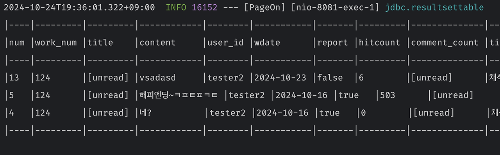
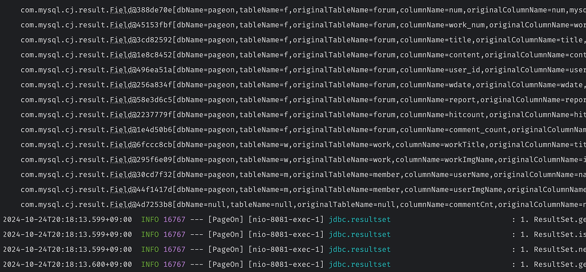
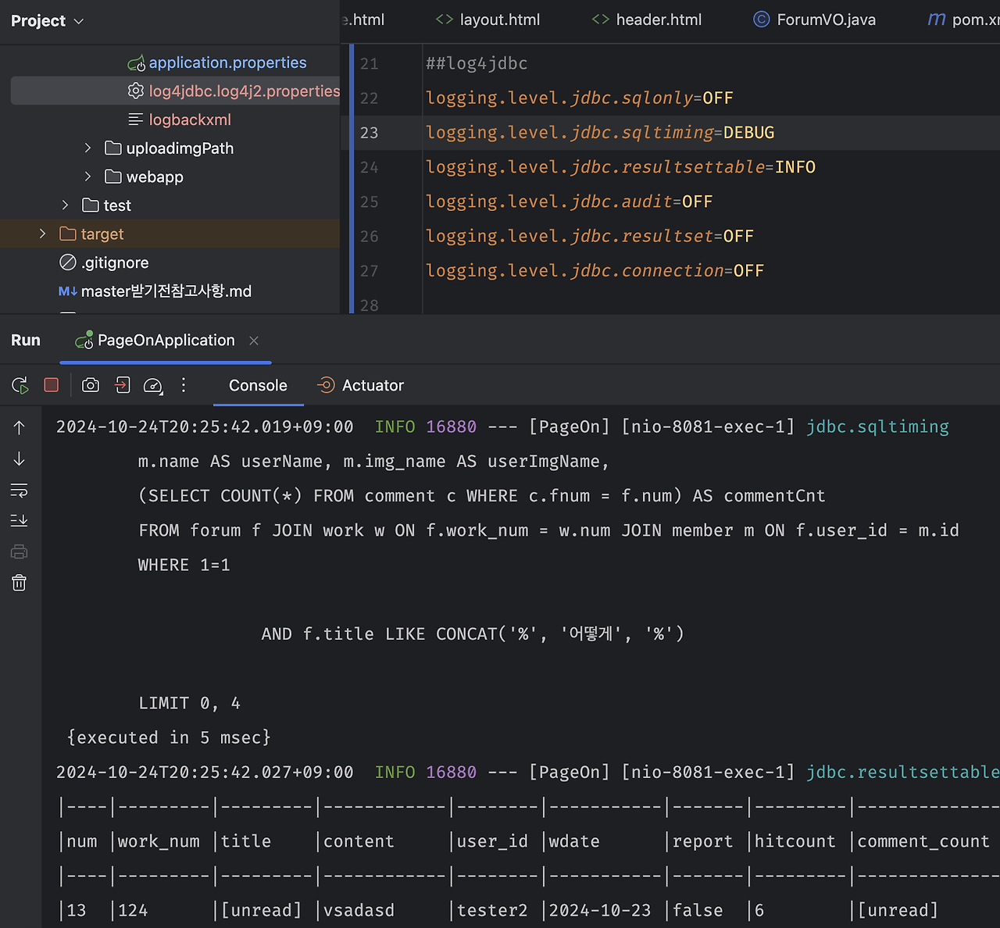

환경: macOS, Spring Boot 3.3.4, Tomcat 10.1.31 (Maven 프로젝트)<br/><br/>
검색을 실행했을 때 목록에는 2건이 출력되는데, 결과 건수는 3개가 카운트되어서 쿼리가 어떻게 처리가 되는지 궁금했습니다<br/>
처음에 구현했을 때는 잘됐는데 테이블을 조인하다 보니 어디선가 꼬인 것 같다<br/><br/>
 
SQL 로그를 출력하는 방법을 열심히 검색<br/>
이것저것 따라해 보고 성공
<br/>
<br/>
## 방법1: logback

src/main/resources에 **logback-spring.xml(혹은 logback.xml)** 파일 생성

```js
//중요한 건 패키지명을 본인 프로젝트에 맞게 변경해야 함 (<logger name="com.tmtb.pageon" 이 부분)
<?xml version="1.0" encoding="UTF-8"?>
<configuration debug="true">
    <appender name="console" class="ch.qos.logback.core.ConsoleAppender">
        <encoder>
            <charset>UTF-8</charset>
            <Pattern>%d %5p [%c] %m%n</Pattern>
        </encoder>
    </appender>
    <logger name="com.tmtb.pageon" level="DEBUG">
        <appender-ref ref="console" />
    </logger>
    <logger name="jdbc.sqlonly" level="INFO">
        <appender-ref ref="console" />
    </logger>
    <logger name="jdbc.resultsettable" level="INFO">
        <appender-ref ref="console" />
    </logger>
</configuration>
```

이제 실행하면 SQL 쿼리가 찍힙니다!

<br/>
<br/>
## 방법2: log4jdbc-log4j2
### log4jdbc-log4j2로 콘솔에 가독성 좋은 테이블 형태로 SQL 실행 결과를 출력할 수 있게 해 본다
 
저는 Maven 빌드라 **pom.xml에 log4jdbc-log4j2 의존성**을 추가

```js
<dependency>
    <groupId>org.bgee.log4jdbc-log4j2</groupId>
    <artifactId>log4jdbc-log4j2-jdbc4.1</artifactId>
    <version>1.16</version>
</dependency>
```

그다음은 src/main/resources/**application.properties** 파일에 아래의 내용을 추가했습니다

```js
spring.datasource.driver-class-name=net.sf.log4jdbc.sql.jdbcapi.DriverSpy
spring.datasource.url=jdbc:log4jdbc:mysql://localhost:3306/your_database
spring.datasource.username=사용자명
spring.datasource.password=사용자비번

logging.level.jdbc.sqlonly=DEBUG
logging.level.jdbc.sqltiming=INFO
logging.level.jdbc.resultsettable=INFO
logging.level.jdbc.audit=OFF
logging.level.jdbc.resultset=OFF
logging.level.jdbc.connection=OFF
```

설정하면 이런 모습입니다


url에 주목하시라
기존의 spring,datasource.url이<br/>
jdbc:mysql://localhost:3306/your_database 이었다면<br/>
jdbc:**log4jdb:c**mysql://localhost:3306/your_database<br/>
이렇게 **log4jdbc:**가 추가되면 됩니다 Mysql 외에 다른 DBMS도 거의 동일
 
그리고 src/main/resources/**log4jdbc.log4j2.properties** 파일도 필요합니다 내용은 아래 두줄입니다

```js
log4jdbc.spylogdelegator.name=net.sf.log4jdbc.log.slf4j.Slf4jSpyLogDelegator
log4jdbc.dump.sql.maxlinelength=0
```

위 내용을 그냥 application.properties에 몰아넣었더니 이상하게 log4jdbc 설정 속성들이 안 먹어서 순순히 log4jdbc.log4j2.properties로 분리했습니다<br/><br/>
 
다시 application.properties로 돌아가서 log4jdbc 설정을 살펴보겠습니다<br/>

- logging.level.jdbc.sqlonly=DEBUG
- **logging.level.jdbc.sqltiming=INFO**
- **logging.level.jdbc.resultsettable=INFO**

이 세 라인이 중요<br/>
다만 전 sqlonly는 비활성화 했어요<br/>

sqlonly=DEBUG는 아래와 같이 파라미터를 포함한 쿼리문을 보여주고


sqltiming=INFO는 쿼리문+쿼리 실행에 소요된 시간 {executed in ..},


resultsettable=INFO는 쿼리 실행 결과를 테이블로 보여줍니다


 
다만 실행 쿼리문이 sqlonly, sqltiming에서 중복으로 출력되기 때문에 
저는 **logging.level.jdbc.sqlonly=OFF (OFF로 명시적으로 비활성화해야 함)로 바꿨음**<br/>
이렇게 하면 sqltiming에서 쿼리문이 실행시간과 함께 한 번만 출력됩니다<br/><br/>
 
마찬가지로 OFF를 해두는 게 좋은 나머지 세 가지를 보면
```js
logging.level.jdbc.audit=OFF
logging.level.jdbc.resultset=OFF
logging.level.jdbc.connection=OFF
```
OFF라서 왠지 생략할 수 있을 것 같다<br/>
하지만 오산입니다 저 세 라인을 빼는 순간 엄청 빼곡한 로그가 밀려옵니다<br/>


아무래도 나노단위의 SQL 디버깅이 필요한 경우에만 활성화하는 게 좋을 듯<br/><br/>

최종적으로 이런 모습입니다<br/>


일부 컬럼이 [unread]로 나오는 이유는 ResultSet이 실제로 읽히지 않은 컬럼을 [unread]로 표시하는 log4jdbc의 특성이라고 합니다<br/>
디버깅 차원에서는 무시해도 될 것 같다<br/><br/>


## 정리
- **logback**: 일반적인 로깅을 처리하면서, SQL 쿼리 로그도 함께 관리할 수 있습니다. 기본 로그 및 다양한 애플리케이션 이벤트를 포함한 로깅이 가능하므로 프로젝트 전반적인 로그 관리에 유리합니다
- **log4jdbc-log4j2**: SQL 쿼리와 결과를 테이블 형식으로 출력하고, 쿼리 실행 시간, 파라미터, 그리고 결과 테이블을 좀 더 가독성 있게 출력하는 데 유용합니다
---
SQL 로그만 필요하면 후자를, 전반적인 로그가 필요하면 전자를 적용하는 게 좋을 듯<br/>
두 개를 같이 사용한다면 logback에서 sql로그를 최소화해 중복을 줄이는 것이 바람직하겠다