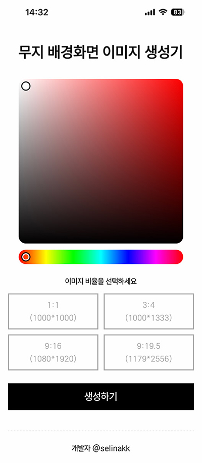
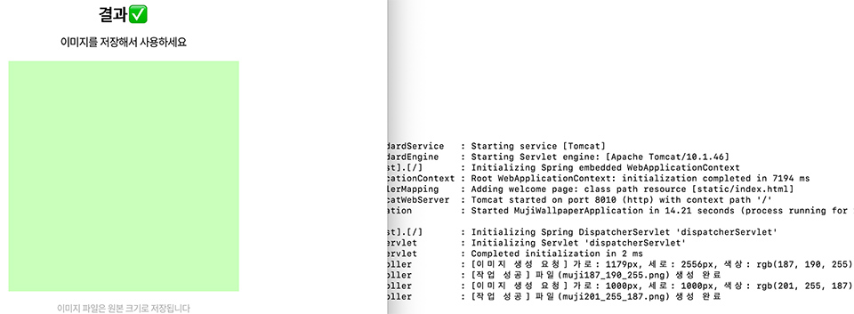
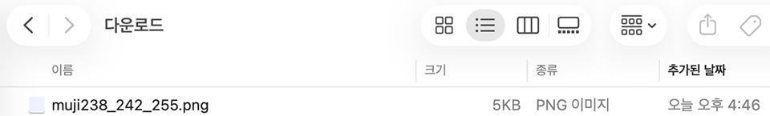
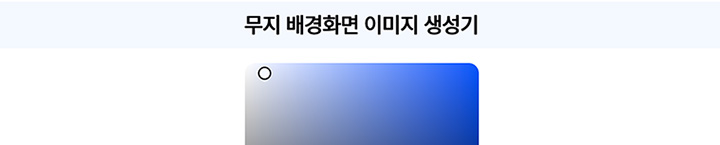
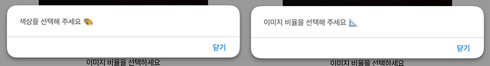

 

무지무지 단순한 **무지 배경화면 이미지 생성기**를 개발했습니다 ​ ..( ͡° ͜ʖ ͡°)
  

## 개발 동기
저는 휴대폰 배경화면을 자주 바꾸는 편입니다 
단순한 무지 색상 배경화면도 애용하기에, (Solid color image generator는 구글에서 쉽게 찾아볼 수 있지만) 한 번쯤 직접 이런 서비스를 만들고 싶었습니다 
내 개인적 필요에 의한 개발은 유용하고 UI/UX를 내 기준으로 맞출 수 있다는 점이 좋습니다 

# MujiWallpaper 🎨
💻 PC에서

📱 모바일에서

## One and Only 기능
색상과 비율을 선택하고 '생성하기' 
생성된 이미지가 페이지 전환 없이 바로 보여지며 저장할 수 있습니다

 
지정한 파일명은 muji + rgb값.png입니다

  
DB도 필요 없는 매우 직관적이고 단순한 애플리케이션이죠  

## 개발 이야기
-Color picker는 [iro.js](https://iro.js.org) 라이브러리를 사용했습니다 

-고른 색상을 잘 보이게 표시하고 싶어서 타이틀 배경색상이 선택한 색상으로 바뀌게 했는데 'UI가 이게 최선인가' 하는 의구심을 아직 못 버렸어요 어두운 배경에서는 타이틀이 감춰지기도 하고..🤔

 

-Color picker에서 색상값을 RGB 객체로 얻고 그 값들을 String으로 만들어 hidden input으로 보냅니다 

-폼을 POST 방식으로 해서 json으로 값을 보내려고 해봤는데 제가 원하는 대로(페이지 전환X, 다운로드 링크X, 이미지를 우클릭해 저장) 이미지를 사용하려면 GET 방식이 적합했습니다 
왜 굳이 우클릭?이라고 묻는다면, 아이폰이 이유라고 답하겠습니다 
갤럭시를 오래 쓰다가 최근에 간만에 아이폰을 사용하게 됐는데 웹에서 이미지 저장 링크를 눌러도 사진 앱에 저장이 안 되더라고요 
찾아보니 이미지를 직접 클릭해서 사진 앱에 저장하는 방식이 답이었습니다 
아이폰 환경에서의 다운로드 링크에 대한 불신이 생겨 능동적인 우클릭 저장 방식으로 만들었습니다 
보안이 중요한 서비스가 아니기에 부담도 없었고요 

-색상이나 비율 값이 null인 상태로 폼을 제출하거나 이미지 생성에 실패하면 alert를 띄웁니다

 

-이번 작업을 하면서 확장성과 구조에 대한 생각을 좀 했습니다 
각 역할을 쉽게 구분할 수 있게 짜임새 있는 구조를 만드는 건 결국 확장성을 키우는 건데 
이건 너무 단순한 애플리케이션이라서 덩어리처럼 뭉쳐서 쓰다가 나중에 리팩토링을 했습니다 
나의 지극히 단순한 필요에 의해 만든 거라 확장할 것 같지는 않지만 언제나 확장 가능한 구조로 코딩할 것..(다짐)
 

-Oracle Cloud는 처음인데 가입이 힘들었지만 느낌이 좋아요 AWS 같은 과금 문제가 없을 것 같은 느낌
