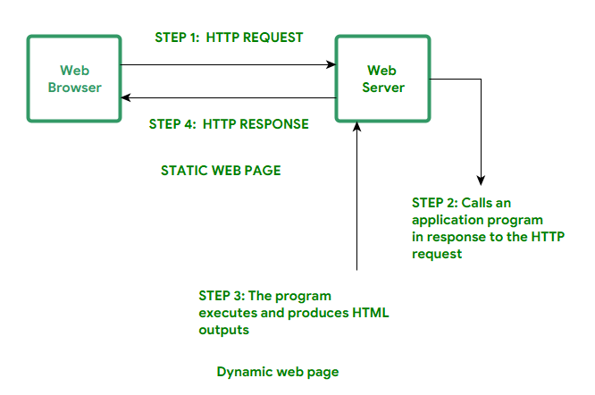

개발을 하다 보면 웹을 정의하는 두 가지 개념을 접하게 됩니다 
바로 static과 dynamic입니다 
두 개념은 웹 설계/배포과정에서 구분이 됩니다  

## static 웹이란?
정적 웹 페이지에 접근하는 모든 사용자는 동일한 컨텐츠를 보게 됩니다 
정적 웹은 주로 HTML, CSS, Javascript를 사용하여 구축되며 서버 측 프로그램이나 애플리케이션이 실행되지 않습니다 
정적인 웹에서는 **사용자가 웹 페이지를 업데이트 할 수 없습니다** 
콘텐츠가 자주 변경되지 않는 랜딩 페이지, 포트폴리오와 같은 간단한 웹사이트가 정적 웹페이지에 적합합니다 
정적인 웹 호스팅을 지원하는 서비스로는 Github Pages, Vercel 등이 있습니다 
지금 이 블로그가 정적인 웹사이트입니다 정적이라 웹에서 직접 글 수정이 불가합니다 
정적 컨텐츠를 수정해서 레포지토리로 푸시를 하면 자동 배포를 통해 수정이 이루어집니다  

## dynamic 웹이란?
사용자의 입력이나 시간 등에 따라 웹 페이지의 내용이 달라질 수 있습니다 
사용자 입력에 따라 즉시 콘텐츠를 생성하고 업데이트된 정보를 제공합니다 = 즉, **사용자가 웹의 상태를 바꿀 수 있습니다** 
동적 웹페이지는 Ajax, JSP, ASP 등의 기술을 사용하여 구축됩니다 Spring에서 dynamic web project를 볼 수 있죠 
동적인 웹은 일반적으로 정적인 웹보다 개발 및 호스팅 비용이 많이 들고 속도가 느릴 가능성이 있습니다 

출처 GeeksForGeeks
  
static 웹은 브라우저가 HTTP 요청을 보내면 웹 서버가 바로 HTML 파일을 전달합니다 따라서 HTTP REQUEST(요청)와 HTTP RESPONSE(응답)만 수행됩니다 
서버가 단순히 요청된 파일을 반환하기 때문에 추가적인 프로그램 실행이 필요하지 않습니다 
 
반면 dynamic 웹 페이지는 요청이 들어오면, 웹 서버가 요청을 받아 애플리케이션 프로그램을 실행하여 HTML 출력을 생성합니다 따라서 1단계에서 4단계까지 모든 단계가 수행됩니다 
HTTP 요청 → 애플리케이션 프로그램 호출 → 프로그램 실행 및 결과 생성 → HTTP 응답  

블로그로 다시 예를 들어보면 
사용자가 블로그 상태를 실시간으로 변경할 수 없는 Github Pages는 정적인 웹이고, 
사용자가 실시간으로 글을 관리하거나 댓글을 남길 수 있는 티스토리 블로그는 동적이라고 할 수 있습니다 